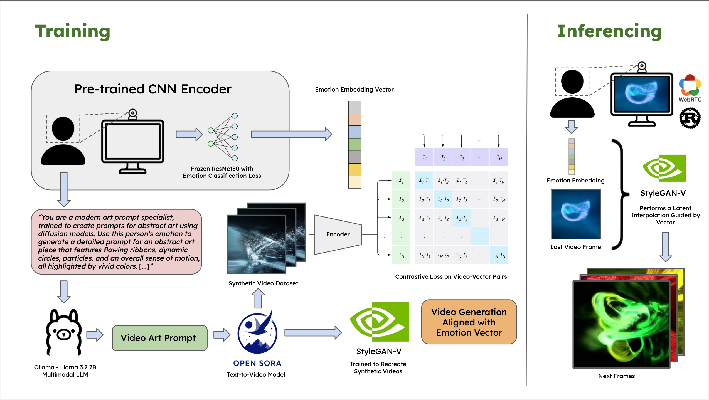

<div align="center">
  <h1 align="center">🎆 Aura</h1>
  <h3>Aligning AI Art with Emotion, in Real Time</h3>
</div>

<div align="center" id="badges">
      
</div>

<br>

<div align="center">
  <table>
    <tr>
      <td></td>
      <td></td>
      <td></td>
      <td></td>
    </tr>
    <tr>
      <td align="center"><b>Anger</b></td>
      <td align="center"><b>Joy</b></td>
      <td align="center"><b>Lust</b></td>
      <td align="center"><b>Sadness</b></td>
    </tr>
  </table>
</div>

> **Aura is a live GAN-based video generator that supports the alignment of someone's emotion (or Aura) with its artistic representation. It uses [StyleGAN-V](https://github.com/universome/stylegan-v)'s model with a [CLIP](https://github.com/openai/CLIP)-like representation of emotion-video pairs to perform interpolations between latents given a new input emotion and the current art state. We've also developed a WebRTC pipeline in Rust to stream model outputs and camera inputs in real time between your browser and your GPUs :)**

## How it Works

<div align="center">
  
</div>

## Progress So Far
- [ ] Host UI on a website
- [ ] Create CLIP-based script for StyleGAN-V interpolations
- [ ] Generate Pairs of Embeddings and Videos with OpenSora and store on a large enough storage
- [ ] Implement Queueing System in Python and in the UI
- [ ] Create model endpoint to receive screen captures
- [x] Create Ollama pipeline to generate video prompts to OpenSora
- [x] Design an image processing pipeline to remove unfairness
- [x] Find an emotion classification dataset
- [x] Create Emotion Classifier Encoder CNN
- [x] Allow screen-capture so that it can be sent to the model
- [x] Create WebRTC renegotiation pipeline in Rust 

## How to Contribute

- The project supports rust-built Python modules as binaries if we need to do something fast i.e. a long Regex, camera I/O, etc :)
- To see details about running `notebooks`, visit [`/notebooks`](../notebooks/README.md)

Where you should be working:

- Python Modules: i.e. Camera input: `aura/camera/` [How to write Python modules](https://arc.net/l/quote/tmyndbro)
- Rust Packages for fast I/O and streaming: `src/lib.rs` (or another Rust module location inside `src`)
- Jupyter Notebooks for AI stuff: `/notebooks`

### Development

> Note: If you're developing on VSCode, download the necessary extensions to make your life easier (e.g. Jupyter Notebooks, Rust Analyzer, PyLint)

In your desired project location, run:

```bash
git clone https://github.com/ghubnerr/aura
cd aura
```

Initiate your conda environment. To download Anaconda and manage your Python environments, go [here](https://www.anaconda.com/download). Here we're using Python 3.10

```bash
conda create -n aura python=3.10
conda activate aura # Run this every time you open your project
```

We'll be using `PyO3` + `Maturin` to integrate Rust and Python in the same package in case we need anything that executes fast. [(Read more here)](https://medium.com/@MatthieuL49/a-mixed-rust-python-project-24491e2af424)

Installing Python Dependencies

```bash
pip install -r requirements.txt
```

### Using A100's for free to run our code in Colab (FIU Students Only)

- Follow instructions in [/notebooks](https://github.com/ghubnerr/aura/blob/main/notebooks/README.md) to connect to clusters and still run our repo.

### Running Tests

Make sure you run this prior:
`maturin develop --extras tests`

<b>Testing Rust Source Code</b>

Download Rust [here](https://doc.rust-lang.org/cargo/getting-started/installation.html)

```bash
cargo test
```

If this doesn't work, try running:

For MacOS

```bash
export DYLD_LIBRARY_PATH="$CONDA_PREFIX/lib:$DYLD_LIBRARY_PATH"
```

For Linux (using `tsch`) -> `onyx` (FIU Server) uses `tsch`

```bash
setenv LD_LIBRARY_PATH "$CONDA_PREFIX/lib:$LD_LIBRARY_PATH"
```

- You will want to add this into your `~/.tcshrc` file (use `nano ~/.tcshrc`):

```bash
source ~/miniconda3/etc/profile.d/conda.csh
setenv PATH "${PATH}:$HOME/.cargo/bin"
if ($?CONDA_PREFIX) then
    if ($?LD_LIBRARY_PATH) then
        setenv LD_LIBRARY_PATH ${CONDA_PREFIX}/lib:$LD_LIBRARY_PATH
    else
        setenv LD_LIBRARY_PATH ${CONDA_PREFIX}/lib
    endif
endif
```

- If it still doesn't work, do this:

```bash
conda activate aura
echo $CONDA_PREFIX # make sure this works
mkdir -p $CONDA_PREFIX/etc/conda/activate.d
touch $CONDA_PREFIX/etc/conda/activate.d/set_ld_library_path.csh
nano $CONDA_PREFIX/etc/conda/activate.d/set_ld_library_path.csh
```

- Write this:

```bash
#!/bin/tcsh
setenv LD_LIBRARY_PATH ${CONDA_PREFIX}/lib
```

- Save it and run this:

```bash
chmod +x $CONDA_PREFIX/etc/conda/activate.d/set_ld_library_path.csh
```

- Now run

```bash
conda deactivate
conda activate aura
```

This is an issue with a PATH variable that Maturin is using to access a Python file. I'm trying to see if there's a way to make this automatic.
<br/>

<b>Running Python Tests</b>

```bash
conda install pytest # Only run this once
```

```bash
pytest
pytest aura/tests # (If the latter doesn't work)
```

### Pushing to Source

1. Make sure you pull first

```bash
git pull
# If there are any conflicts, use `git stash`, then `git pull`, and then `git stash pop`. Address the conflicts there using VSCode Merge Editor
```

2. Commit your changes to a new branch

```bash
git add .
git commit -m "<your-message>"
git checkout -b <your_github_name>/<your_branch_feature>
git push -u origin <your_github_name>/<your_branch_feature>
```

3. Create a Pull Request for your branch on GitHub
