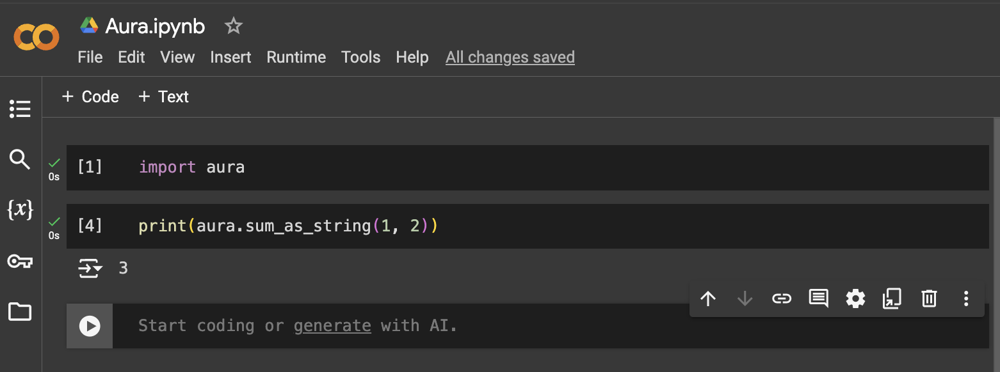

## Making the best use of Colab's runtime and our repo's Source Code

So, there's two ways you can approach still developing notebooks in Google Colab while being able to access your repo's functionalities.

### 1. Running Colab hosted on your local runtime

You will want to do this when:

- You trust you don't need a GPU as good as what Google Colab can give you
- You won't need that much RAM (you're assuming your computer can handle it)
- You need the repo's source code

<b>How to set it up:</b>

1. Install these on your environment `aura`:

```bash
conda install -c conda-forge jupyter_http_over_ws
```

```bash
jupyter server extension enable --py jupyter_http_over_ws
```

```bash
pip install jupyter_http_over_ws # Run this in case it fails
```

2. Open a Jupyter Notebook Connection

```bash
jupyter notebook --NotebookApp.allow_origin='https://colab.research.google.com' --port=8888 --NotebookApp.port_retries=0
```

3. Copy your token. It should begin with `http://localhost:8888`


4. Open https://colab.research.google.com and create the Notebook you want

5. On the top-right corner, click Connect > Connect to a local runtime

6. Paste your token

7. Enjoy! Now you're running Rust, in Python, in Jupyter, in Colab! 🤯



### 1.1 Using on-campus A100's on our project, on Colab :)

There are 4 compute services at FIU that no one knows about! Not even Trevor Cickovski knew LOL
| Onyx | Diamond | Quartz | Ruby |
|---------|---------|---------|---------|
|  |  |  | `ruby.cs.fiu.edu` |

What you'll have to do:

1. Pick an endpoint (all of them are `<name>.cs.fiu.edu` i.e. `onyx.cs.fiu.edu`)
2. SSH into it using your terminal. `-v` is for verbose, so you'll see the output.

```bash
ssh <fiu_username>@onyx.cs.fiu.edu -v
```

3. Enter your password -- this will be the exact same password you use for `ocelot.aul.fiu.edu`. If you've never used ocelot, it will be:

- The first letter of your first name
- Your Panther ID
- The first letter of your last name

4. You can now go into your VSCode and use your RemoteSSH extension to connect to the cluster. If you have a Mac, you can also use `Microsoft Remote Desktop` (App Store) and access the GUI of the machine.
5. You're almost ready to follow the instructions in the root [README]("https://github.com/ghubnerr/aura/blob/main/README.md") on setting up the repository, but your campus endpoint might not have anaconda installed. Here are the steps to do so:

- You can download the installer for [Miniconda](https://arc.net/l/quote/bhzadcnf), and run

```bash
# If you're not an administrator to your campus endpoint, you can't run `sudo dnf install`
scp <installer/file/location> <fiu_username>@<cluser_name>.cs.fiu.edu:~/
```

- After finishing the Miniconda installation process, open the cluster shell, and run

```bash
bash <conda-installer-name>-latest-Linux-x86_64.sh
```

- Note, the ocelot shell is a TENEX C Shell by default, so you have to do the following after running:
- Do `nano ~/.tcshrc` and paste `source ~/miniconda3/etc/profile.d/conda.csh`
- You can now run `conda` commands normally
- Note 2, for Linux, use `export LD_LIBRARY_PATH="$CONDA_PREFIX/lib:$LD_LIBRARY_PATH"` if `cargo test` doesn't work

6. You'll then come here and follow the same instructions as #1 to connect to Colab with local runtime.
   

Enjoy 8 A100's that also run Rust. In Colab :)

## 2. Using Colab traditionally (with imported files)

You will want to do this when:

- You have a sh$t computer :)
- You don't need the repo's codebase to run whatever you want to run (unless you import it)
- You need RAM and compute (GPUs)

### Using Google Drive to upload files

Export the entire repo `/aura` into your Google Drive, and you'll be able to access the files from there. Or you can simply upload a Jupyter Notebook file you already have.

```python
from google.colab import drive
drive.mount('/content/drive')
```

<br>
<br>
ps: Make sure to post your notebooks into the repo!
